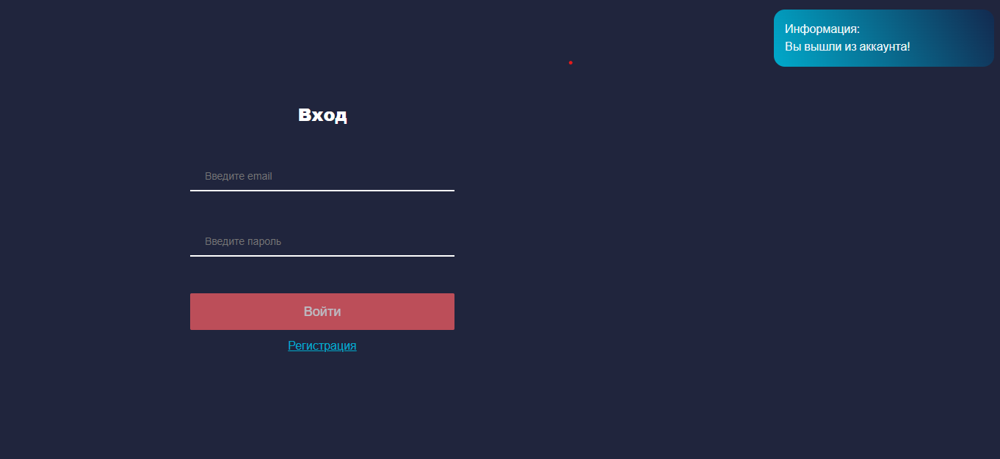
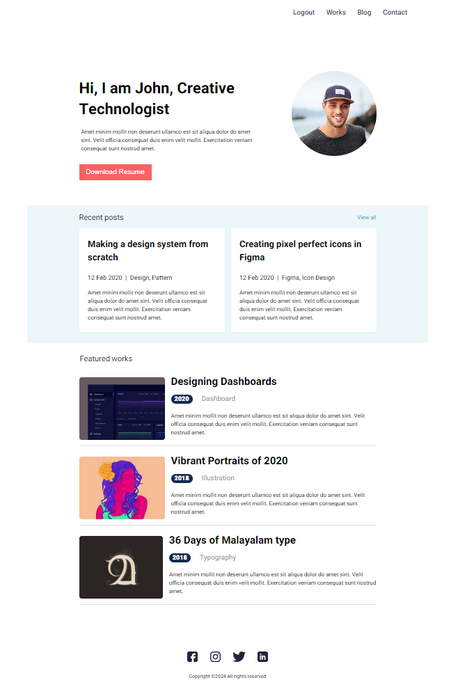

### app-john

#### Технологии

  
  
  
  

#### О проекте

Приложение из 3-х страниц (Страница авторизации, страница регистрации, главная страница).
Access токен хранится в localStorage, refresh токен хранится в cookie. 

Макет: https://www.figma.com/file/u96UjK2Kzo2bk0PhVdL5xr/John-%2B?type=design&node-id=0-1&mode=design&t=n00hl8GhumWEknWc-0

#### Установка и запуск приложения

Версия node.js 20.10.0 и выше!

Клонировать репозиторий (backend):

    git clone https://github.com/Mariyazakharova73/server-app-john.git

Установить зависимости:

    npm i

Запустить проект:

    npm run dev

Клонировать репозиторий (frontend):

    git clone https://github.com/Mariyazakharova73/app-john.git

Установить зависимости:

    npm i

Запустить проект:

    npm start

  
  

